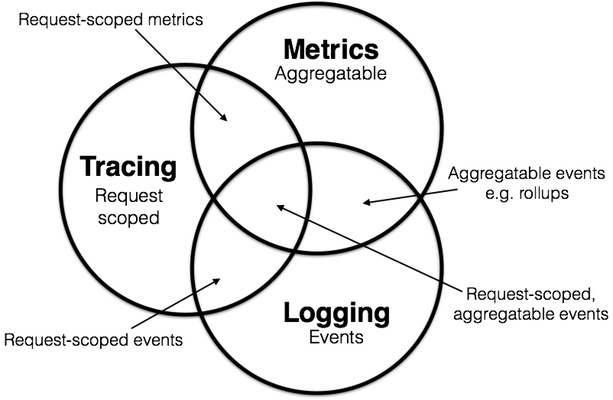

# 核心概念

日志（Loggin）、指标（Metrics）和追踪（Tracing）是紧密相关的三个核心概念。下面这张图能够很清楚的描述了这三者之间的关系：

- 日志（Loggin）

日志描述的是一些不连续的离散时间。例如，有些业务系统采用ELK（Elasticsearch+Logstash+Kibana）或类似技术栈的日志手机系统，
它们是分布式监控系统的早期形态，借鉴了传统应用解决问题的方式，是最容易理解的解决方案。

- 指标（Metrics）

指标是可累加的，它具有原子性。每个指标都是一个逻辑计量单元，体现了一段时间之内相关指标的状态。
例如：队列当前的深度可以被定义为一个计量但愿，在写入或读取时更新；输入 HTTP 请求的数量可以被定义为一个计数器，用于进行简单累加；请求的执行时间可以被定义为一个柱状图，在指定时间片上更新和汇总。

- 追踪（Tracing）

追踪在监控领域通常被称为分布式追踪，是指在单次请求范围内处理信息。任何的数据和元数据信息都被绑定到了系统中的单个事务上。
追踪能力是近几年技术人员最为关注的需求，由 Twitter 开源的 Zipkin 是目前运用最为广泛的分布式追踪系统之一。

上面介绍的三个概念并不是相互独立的，往往会有一定的重叠，复杂和完善的监控系统一般是跨越多个维度的。

- 追踪（Tracing）+ 日志（Loggin）：这是多数分布式追踪系统的早期形态，通过简单的上下文传递，可以将请求的上下文ID输出到日志，让日志具备时间维度之外的另外一个关键维度——上下文关联。通过时间和上下文关联让这两个维度的组合，用户可以快速感受到分布式追踪带来的强大优势。

- 日志（Loggin）+ 指标（Metrics）：这是日志分析系统的常规架构，可通过系统现有的业务日志获取相关的指标数据。

- 追踪（Tracing）+ 指标（Metrics）： 用于指明基本分布式追踪系统的数据分析指标、应用间的关系以及数据流向等。

日志、指标、追踪可以看作功能全集中的元素，一些商业级别的 APM （Application Performance Managment，应用性能管理） 系统便采用 “追踪+指标”的方式提供一体化的解决方案。
充分理解这三个概念，能够更好定位目前市面上的各种开源和商业监控体系工具，理解它们的核心优势。

后面就将介绍分布式追踪系统。