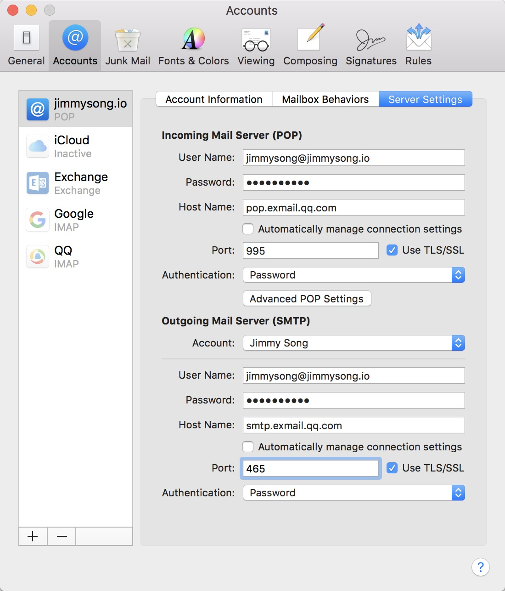
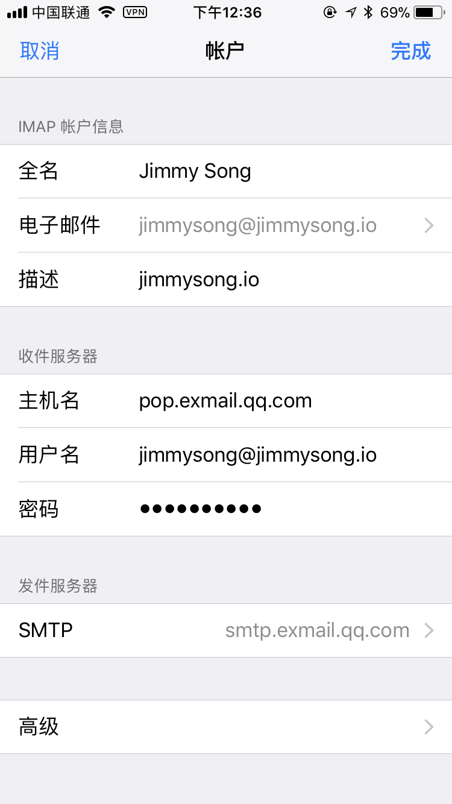
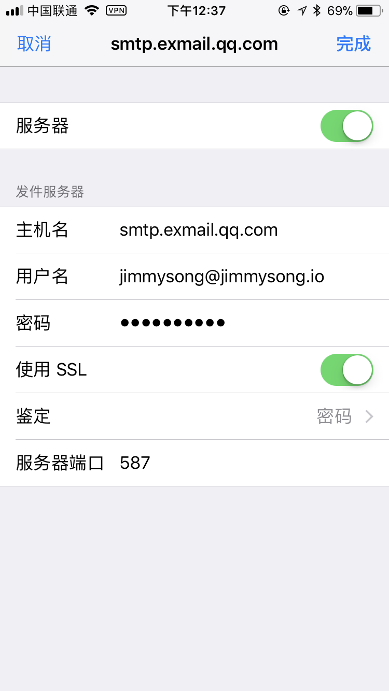

# 自定义邮件服务器

我们当初在注册域名之时没有开设域名邮箱，如果开设的话需要另外付费。我们使用了免费版的[腾讯企业邮箱](https://exmail.qq.com/login)。

免费版本的腾讯企业邮箱有以下限制：

- 50人帐号上限
- 2G邮箱容量
- 2G企业网盘
- 2G个人中转站

## 步骤

创建个人域名邮箱的步骤为：

- 申请一个腾讯企业邮箱
- 在[cloudflare](https:/www.cloudflare.com)的DNS中增加MX字段
- 在申请的腾讯企业邮箱中增加成员邮箱地址
- 配置邮件收发客户端

### 配置邮件客户端

**POP3/SMTP协议接收邮件服务器**：pop.exmail.qq.com ，使用SSL，端口号995

**发送邮件服务器**：smtp.exmail.qq.com ，使用SSL，端口号465

在Mac中配置Mail中的邮箱账号，如下图所示。

在iPhone中配置邮件客户端如下图所示。

## 参考

- [How do I add or edit mail or MX records?](https://support.cloudflare.com/hc/en-us/articles/218069617-How-do-I-add-or-edit-mail-or-MX-records-)
- [如何使用域名在客户端设置IMAP、POP3/SMTP？](http://service.exmail.qq.com/cgi-bin/help?subtype=1&&id=28&&no=1001254)
- [如何设置IMAP、POP3/SMTP及其SSL加密方式？](http://service.exmail.qq.com/cgi-bin/help?subtype=1&&id=28&&no=1000585)

