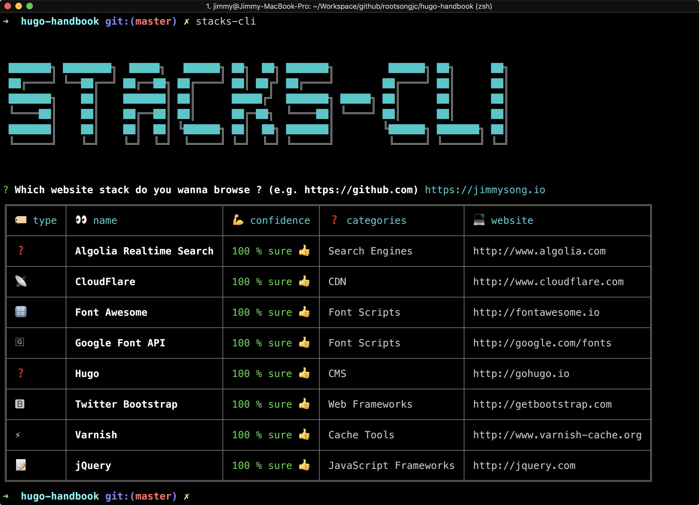

# 网站构建环境配置

我们的网站会用到以下组件：

- [Hugo](https://gohugo.io)：用于静态html生成和进行内容管理
- [Cloudinary](https://www.cloudinary.com)：用于托管图片和静态文件
- [GitHub](https://github.com)：用于存储网站代码同时托管网站
- [Algolia](http://www.algolia.com)：用于站内搜索
- [CloudFlare](http://www.cloudflare.com)：用于DNS解析和CDN加速

使用[stacks-cli](https://github.com/WeiChiaChang/stacks-cli)命令行工具可用于分析任何网站的技术栈，Chrome浏览器也提供了这样的工具[Wappalyzer](https://www.wappalyzer.com/)。

