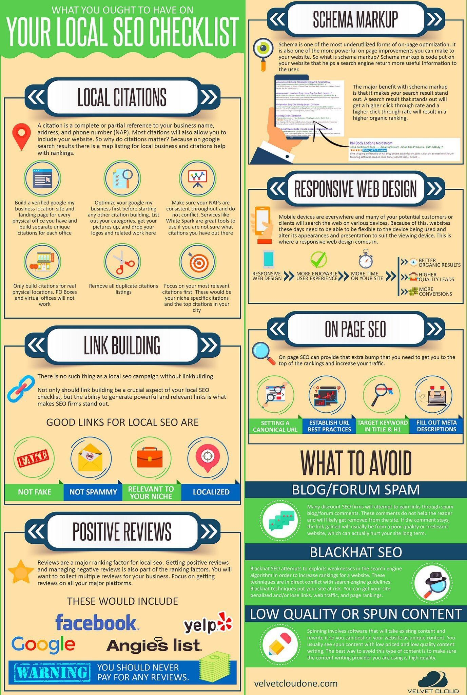

# 搜索引擎优化（SEO）

搜索引擎优化简称SEO（Search Engine Optimizing）。

在您的网站上线后，做SEO时需要检查如下内容：

- 集成Google Analytics或百度统计
- 为页面增加header信息，如title和description
- sitemap.xml，大多数网站生成工具都会自动生成站点地图，生成之后将其URL提交的Google Webmaster Tools。
- robots.txt，阻止搜索引擎爬取网站上的敏感网页
- 结构化数据：可以帮助爬虫理解页面内容，参考[HTML5的结构化数据](http://schema.org/docs/full.html)

## 检测破损URL

使用Google webmaster可以检测网站的破损URL，如下图所示：


## Hugo SEO

下面是对使用 Hugo 生成静态网页的 SEO 优化建议。

## 页面关键词

为每篇博文设置关键词：

```yaml
---
keywords:
- mysite
- mysite keyword
- Another useful keyword
title: My Homepage
---
```

需要在文章模板的 `header` 的 `<meta>` 中添加关键词字段。

```html
<meta content="{{ delimit .Keywords ", " }}" name="keywords">
```

## 页面标题

同样，每篇文章都要有一个标题，这样方便搜索引擎收录，Hugo 生成的文章一般都会在文章的头部增加该字段，同时文章模板的 `header` 中也需要有 `<title>` 标签。

```html
<title>{{ $isHomePage := eq .Title .Site.Title }}{{ .Title }}{{ if eq $isHomePage false }} - {{ .Site.Title }}{{ end }}</title>
```

也可以在 `meta` 中添加标题标签。

```html
<meta content="{{ $isHomePage := eq .Title .Site.Title }}{{ .Title }}{{ if eq $isHomePage false }} - {{ .Site.Title }}{{ end }}" property="og:title">
```

## 页面描述

在 hugo 的网站配置文件 `config.toml` 中设置网站的配置信息，这将显示在浏览器的标签上，该设置是 hugo 内置的。

```toml
[params]
description = "Site stuff for being a good site with internet tubez."
```

同时也可以为每篇文章设置描述信息，这个 `description` 是十分有用的，当你通过各种社交软件分享页面的时候会解析该字段，同时显示页面的描述信息。

```yaml
---
keywords:
  - mysite
  - mysite keyword
  - Another useful keyword
title: My Homepage
description: Where you should come to find my homepage updates and stuff
---
```

同样是在模板的 `header` 中的加入标签。

```html
<meta content="{{ $isHomePage := eq .Title .Site.Title }}{{ .Site.Params.description }}{{ if eq $isHomePage false }} - {{ .Description }}{{ end }}" property="og:description">
```

要时刻牢记 SEO 的观念，你的文章是你对外的最好展示窗口，当你将文章的信息格式化话后，还可以对自己发表的文章进行统计分析。

下面是SEO checklist供大家参考：



## 参考

- [Front-End-Checklist - Github](https://github.com/thedaviddias/Front-End-Checklist)
- [SEO 查询 - 站长之家](http://seo.chinaz.com/)