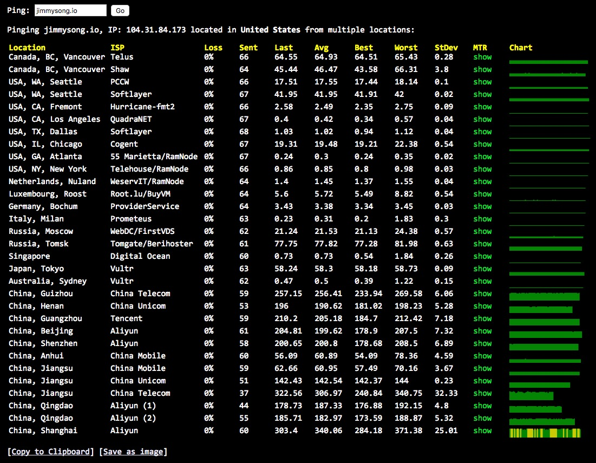
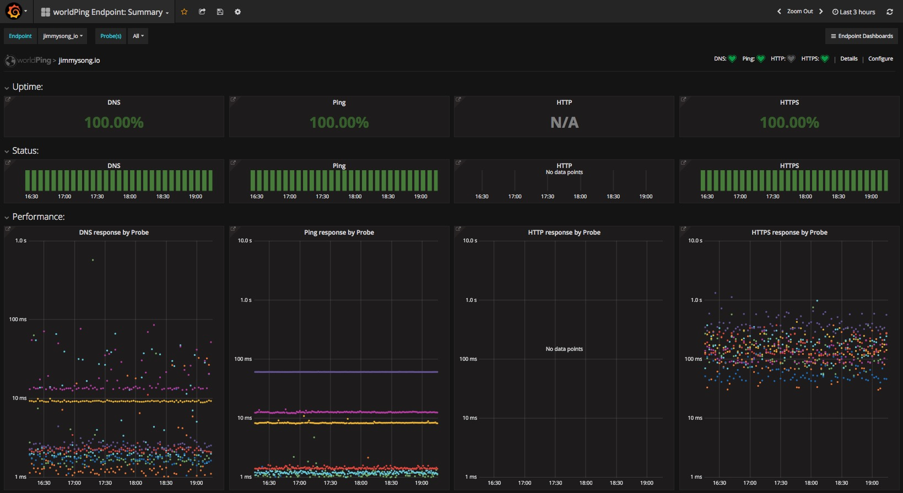

# 网站性能优化

对于静态网站，主要可以优化的地方就是网站的加载速度。

## 了解你的网站性能

查看世界各地访问该网站的速度。

使用[ping.pe](http://ping.pe)，ping [jimmysong.io](https://jimmyosng.io)的效果如图：

另外还可以使用[Grafana](https://grafana.com/)的插件，并安装worldping插件，效果如下图所示：

