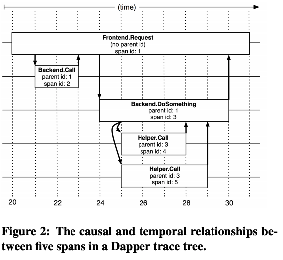
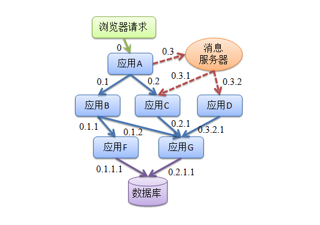
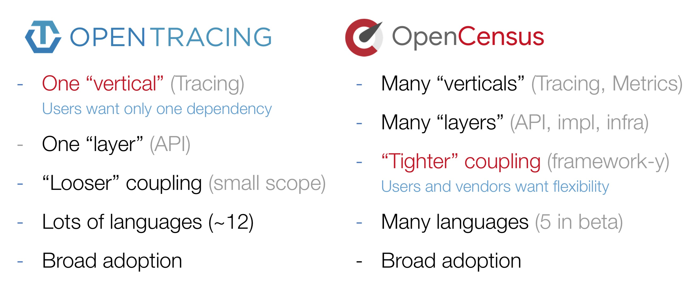
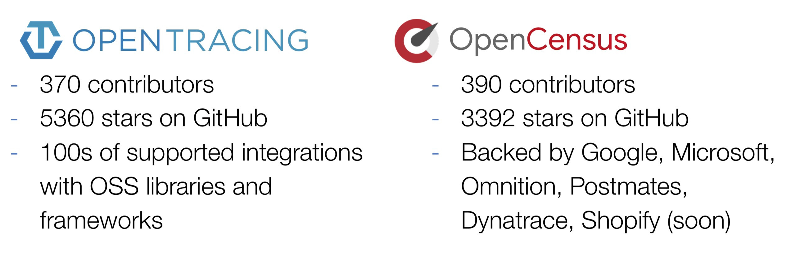
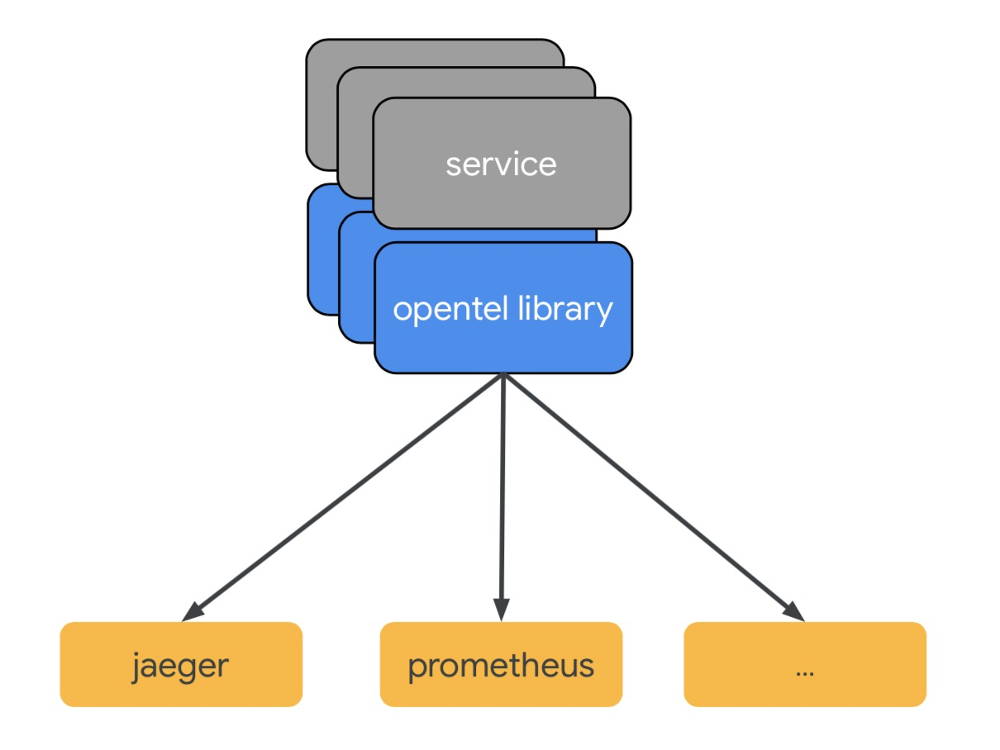
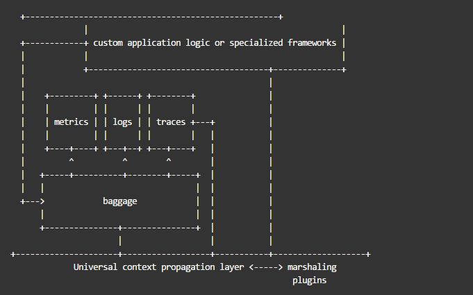

# 分布式追踪

## 概述

分布式追踪的概念源自最早面对超大规模分布式场景的 Google 公司于2010年发表的论文——[《Dapper, a Large-Scale Distributed Systems Tracing Infrastructure》](https://ai.google/research/pubs/pub36356)。
论文中详细地介绍了 Google 的 Dapper 系统实现及原理，Dapper 的核心算法是在分布式请求的上下文中加入 span id 以及 parent id , 用于记录请求的上下级关系，如下图所示：

阿里巴巴公司曾经分享过鹰眼系统的实现方案，也是国内早期的分布式追踪系统实现方案，鹰眼系统使用类似书签索引，简化了 parent id 和 span id 的表达方式, 一个浏览器请求可能触发的系统间调用如下图所示：

鹰眼系统与 Dapper 在原理上没有本质区别。之所以在这里提及，是因为鹰眼系统的编码方案可以帮助读者理解 Trace 树形结构。但是，需要强调的是，Trace 并非只有树形结构，对于消息消费、异步处理等批量模型，会出现一条 Trace 关联多个 TraceId 的情况。

## 目前常见的开源解决方案

Apache Zipkin 是起步最早、社区生态最为完备的分布式追踪系统解决方案。它借助了稳定的 API 库以及广泛的集成，几乎覆盖了从开源到商业级别的分布式系统的各个角落。
其覆盖的语言包括 Java、C#、Go、JavaScript、Ruby、Scala、C++、PHP、Elixir、Lua等，甚至为每种语言都提供了不止一种 API 库，更好地适应了各种不同的应用场景。

OpenTracing 是 CNCF 托管的分布式追踪项目，它的官方定位是针对分布式追踪的 API 标准库，与厂商无关，旨在为不同的分布式追踪系统提供统一的对外 API 接入层。 因此，OpenTracing 并不包含任何实现，可以将它理解为接口协议，类似于 Java 的数据库访问接口 JDBC。

需要强调的是，OpenTracing 只是一套可选的接口 API 库，并非分布式追踪的实现标准，其原生支持者同样是 CNCF 托管的项目——Jaeger。另外，前面提到的运用最为广泛的分布式追踪系统 Zipkin 并不是 OpenTracing 的主要支持，Zipkin 具有完全独立的规范、协议和 API 接口。所以到目前为止，还不能承认 OpenTracing 是分布式追踪领域的 API 标准。

OpenCensus 来自于 Google，是2017年才崭露头角的新兴项目。它的定位介于 OpenTracing 和 Zipkin 之间，提供了统一的 API 层，同时提供了部分实现逻辑。
工程师只需在 OpenTracing 的基础上自定义实现最小范围的逻辑（比如上下文传递和数据格式上行）即可。 OpenCensus 目前支持发送 Zipin、Jaeger、 Stackdriver 和 SignalFx 格式的数据。 OpenCensus 在 Google 的大力支持下，已经成为 OpenTracing 的有力竞争者。

## OpenTracing vs OpenCensus

两套Tracing框架，都有很多追随者，都想统一对方，如下图对比了 OpenTracing 和 OpenCensus:

可以看到，OpenTracing和OpenCensus从功能和特性上来看，各有优缺点，半斤八两。OpenTracing支持的语言更多、相对对其他系统的耦合性要更低；OpenCensus支持Metrics、从API到基础框架都实现了个遍。既然从功能和特性上分不出高下，从知名度和用户数上来看做对比：

可以看到基本平衡，OpenTracing有很多厂商追随（比如ElasticSearch、Uber、DataDog、还有国产的SkyWalking），OpenCensus背后Google和微软两个就够撑起半边天了。

## OpenTelemetry

### 横空出世

所谓天下合久必分、分久必合，既然没办法分个高低，谁都有优劣势，咱们就别干了，统一吧。于是OpenTelemetry横空出世。

那么问题来了：统一可以，起一个新的项目从头搞吗？那之前追随我的弟兄们怎么办？不能丢了我的兄弟们啊。

放心，这种事情肯定不会发生的。要知道 OpenTelemetry 的发起者都是 OpenTracing 和 OpenSensus 的人，所以项目的第一宗旨就是：兼容 OpenTracing 和 OpenSensus。对于使用 OpenTracing 或 OpenSensus 的应用不需要重新改动就可以接入 OpenTelemetry。

### 核心工作

OpenTelemetry 可谓是一出生就带着无比炫目的光环：OpenTracing支持、OpenSensus支持、直接进入CNCF sanbox项目。但OpenTelemetry也不是为了解决可观察性上的所有问题，他的核心工作主要集中在3个部分：

- 规范的制定，包括概念、协议、API，除了自身的协议外，还需要把这些规范和W3C、GRPC这些协议达成一致；
- 相关SDK、Tool的实现和集成，包括各类语言的SDK、代码自动注入、其他三方库（Log4j、LogBack等）的集成；
- 采集系统的实现，目前还是采用OpenSensus的采集架构，包括Agent和Collector。

可以看到OpenTelemetry只是做了数据规范、SDK、采集的事情，对于Backend、Visual、Alert等并不涉及，官方目前推荐的是用Prometheus去做Metrics的Backend、用Jaeger去做Tracing的Backend。

看了上面的图大家可能会有疑问：Metrics、Tracing都有了，那Logging为什么也不加到里面呢？

其实Logging之所以没有进去，主要有两个原因：

- 工作组目前主要的工作是在把OpenTracing和OpenSensus的概念尽早统一并开发相应的SDK，Logging是P2的优先级。
- 他们还没有想好Logging该怎么集成到规范中，因为这里还需要和CNCF里面的Fluentd一起去做，大家都还没有想好。

### 终极目标

OpenTelemetry的终态就是实现Metrics、Tracing、Logging的融合，作为CNCF可观察性的终极解决方案。

- Tracing：提供了一个请求从接收到处理完毕整个生命周期的跟踪路径，通常请求都是在分布式的系统中处理，所以也叫做分布式链路追踪。
- Metrics：提供量化的系统内/外部各个维度的指标，一般包括Counter、Gauge、Histogram等。
- Logging：提供系统/进程最精细化的信息，例如某个关键变量、事件、访问记录等。

这三者在可观察性上缺一不可：基于Metrics的告警发现异常，通过Tracing定位问题（可疑）模块，根据模块具体的日志详情定位到错误根源，最后再基于这次问题调查经验调整Metrics（增加或者调整报警阈值等）以便下次可以更早发现/预防此类问题。

#### Metrics、Tracing、Logging融合的关键

实现Metrics、Tracing、Logging融合的关键是能够拿到这三者之间的关联关系.其中我们可以根据最基础的信息来聚焦，例如：时间、Hostname(IP)、APPName。这些最基础的信息只能定位到一个具体的时间和模块，但很难继续Digin，于是我们就把TraceID把打印到Log中，这样可以做到Tracing和Logging的关联。但这还是解决不了很多问题：

- 如何把Metrics和其他两者关联起来
- 如何提供更多维度的关联，例如请求的方法名、URL、用户类型、设备类型、地理位置等
- 关联关系如何一致，且能够在分布式系统下传播

在OpenTelemetry中试图使用Context为Metrics、Logging、Tracing提供统一的上下文，三者均可以访问到这些信息，由OpenTelemetry本身负责提供Context的存储和传播：

- Context数据在Task/Request的执行周期中都可以被访问到
- 提供统一的存储层，用于保存Context信息，并保证在各种语言和处理模型下都可以工作（例如单线程模型、线程池模型、CallBack模型、Go Routine模型等）
- 多种维度的关联基于Tag（或者叫meta）信息实现，Tag内容由业务确定，例如：通过TrafficType来区别是生产流量还是压测流量、通过DeviceType来分析各个设备类型的数据...
- 提供分布式的Context传播方式，例如通过W3C的traceparent/tracestate头、GRPC协议等

下面是Yuri Shkuro画的原型设计：

#### 当前状态以及后续路线

目前OpenTelemetry还处于策划和原型阶段，很多细节的点还在讨论当中，目前官方给的时间节奏是：

- 2019年9月，发布主要语言版本的SDK（Pre Release版）
- 2019年11月，OpenTracing和OpenSensus正式sunsetted（ReadOnly）
- 未来两年内，保证可以兼容OpenTracing和OpenSensus的SDK

从Prometheus、OpenTracing、Fluentd到OpenTelemetry、Thanos这些项目的陆续进入就可以看出CNCF对于Cloud Native下可观察性的重视，而OpenTelemetry的出现标志着Metrics、Tracing、Logging有望全部统一。

但OpenTelemetry并不是为了解决客观性上的所有问题，后续还有很多工作需要进行，例如：

- 提供统一的后端存储，目前三类数据都是存储在不同系统中
- 提供计算、分析的方法和最佳实践，例如动态拓扑分析
- 统一的可视化方案
- AIOps相关能力，例如Anomaly Detection、Root Cause Analysis等

## 参考

- [OpenTelemetry-可观察性的新时代](https://yq.aliyun.com/articles/710154?utm_content=g_1000068266)

