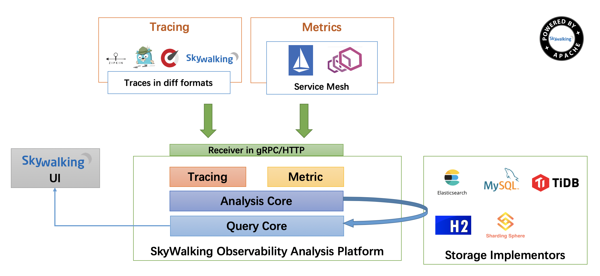

# Apache Skywalking 介绍

从[官方](http://skywalking.apache.org)来看，Skywalking 定位于一款专为微服务、云原生架构和基于容器（Docker、K8s、Nesos）架构而设计的分布式系统应用程序性能监控工具。

SkyWalking 是观察性分析平台和应用性能管理系统。提供分布式追踪、服务网格遥测分析、度量聚合和可视化一体化解决方案。

Skywalking 从以大数据平台为主的分析模式，进化为轻量化、低延迟的分析模式，同时支持分布式追踪和非侵入式的语言探针这两种模式，是能够提供一致性解决方案的开源项目。

自[项目](https://github.com/apache/skywalking) 创建至今，大家会发现，Skywalking 在不停地进行大规模的重构、迭代和演进，强大的开源社区力量是项目能够得到良好发展的根基。

目前项目有两条主线分支：

- 5.x 版本分支：稳定版本，处于维护状态，主要用于修复版本Bug以及扩展语言探针插件。
- 6.x 版本分支：目前也处于稳定版本，目的是替代 5.x 版本成为主推的生产分支，提供了基于语言探针和 Service Mesh 探针的数据收集，具有统一可定制化的数据分析、数据展现能力。

## Skywalking 6 可观察性分析平台

Skywalking 6 不局限于以往的基于多语言探针的思想，它面向多数据源，可提供统一、高效、可定制化的可观察性分析平台解决方案，如下图所示：

可观察性分析平台（Observability Analysis Platform， OAP） 是 Skywalking 社区 PMC 团队提出的新概念，OAP 将可观察性分为两个维度和三个层面：

### 两个维度

- Tracing 追踪链路数据
- Metrics 指标数据

### 三个层次

- Receiver 接收器，针对不同协议提供解析和适配能力。
- Analysis Core 分析内核，提供面向 Source 分析源的流式分析方法，并派生出 OAL(Observability Analysis Language，可观察性分析语言) 来描述流式分析。
- Query Core 查询内核，基于拓扑结构、基础数据和指标数据等多个维度提供基于 GraphQL 的查询，为页面和第三方系统集成提供支持。

